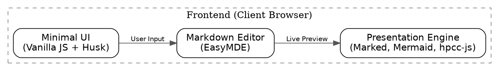

# Markdown Presenter — Spec

## What It Is

A self-contained markdown viewer/presenter. Modular for development, yet capable of being bundled into a single-file offline HTML.
Open the app, pick a folder, and instantly view/present/print your markdown.

## Tech Stack & Major Decisions

*   **Frontend (Vanilla JS/TS):** We intentionally avoided heavy frameworks (React/Next). The UI is minimal and uses a custom lightweight library called `Husk`.
*   **Runtime (Deno):** Deno provides a complete ecosystem for transpilation, bundling, and local serving without a complex `node_modules` setup.
*   **Modular ESM (Import Maps):** We use browser-native Import Maps to manage dependencies (marked, mermaid, hpcc-js) modularly.
*   **Husk Localized**: The `Husk` framework is localized within the project for rapid, co-located development.

## Taxonomy: Modes & Channels

### Modes
*   **View/Read**: Default scrollable view.
*   **Present**: Fullscreen slideshow mode (shortcut: `p`).
*   **Print**: Optimized for 16:9 PDF export (shortcut: `Cmd+P`).
*   **Edit**: Inline markdown editing via EasyMDE.

### Channels
*   **Dev**: Local development via `deno task dev`. Transpiles TS on-the-fly.
*   **Webapp**: Optimized for static hosting/Deno Deploy.
*   **Standalone**: Fully self-contained HTML (`dist/markdown-presenter.html`) for offline use.

## Build Pipelines

| Channel | Pipeline | Technology | Output |
| :--- | :--- | :--- | :--- |
| **Dev** | `deno task dev` | Husk (`transpile`) | Memory / Local Server |
| **Webapp** | `deno task build` | Husk (`transpile`) | `ui-dist/` |
| **Standalone** | `deno task standalone` | Husk (`bundle` + inline) | `dist/markdown-presenter.html` |



## Architecture

### Loading Model

User picks a folder via `showDirectoryPicker`. The app scans it for `.md` files.
Relative images are resolved via a directory handle and converted to blob URLs.

Priority on load:
1. `?md=URL` query parameter.
2. `<script id="default-doc">` (for shared files).
3. Stored directory handle in IndexedDB.
4. User guide (`user-guide.md`).

### Rendering Pipeline

```
markdown text
  → await marked.parse()      → HTML string
  → contentDiv.innerHTML      → inject into DOM
  → resolveRelativeAssets()   → rewrite img src to blob URLs
  → renderMermaid()           → render mermaid blocks
  → renderDotDiagrams()       → render dot blocks (@hpcc-js/wasm)
  → wrapSections()            → nest into section divs
  → applyPageClass()          → add .page to h1, h2
  → splitPagesAtHr()          → handle manual page breaks
```

### Settings Persistence (IndexedDB)

Three-layer cascade (Factory → User → Document):
- **Normal changes** → save to document layer.
- **Factory** → revert to built-in defaults.
- **Save** → promote current to user profile.

## Keyboard Shortcuts

| Key | Action |
|-----|---------|
| `p` | `enterPresent()` |
| `r` | `refreshMarkdown()` |
| `o` | `loadMarkdownWithHandle()` |
| `e` | Toggle `Edit` mode |
| `Escape` | Toggle details panel |
| `←` `↑` | Previous slide |
| `→` `↓` | Next slide |
