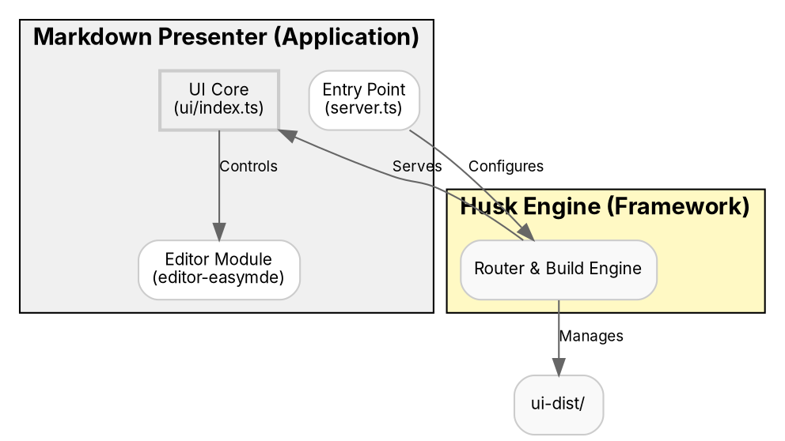
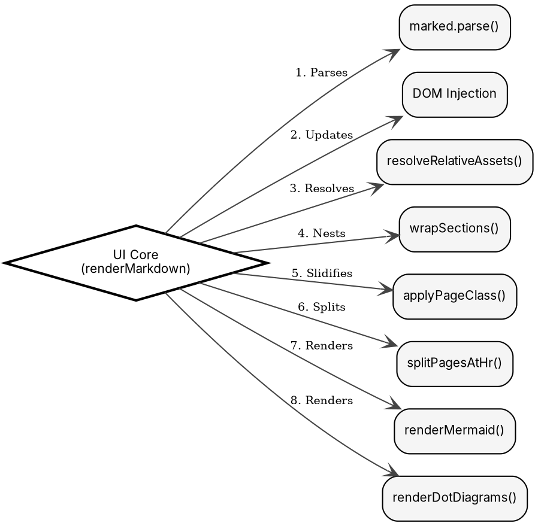

# Markdown Presenter — Spec

## What It Is

A self-contained markdown viewer/presenter built on the **Husk Engine**. 
Modular for development, yet capable of being bundled into a single-file offline HTML.

## Tech Stack

*   **Engine:** [Husk Framework](./husk/README.md) (Smart Lazy & Incremental Build).
*   **Runtime:** Deno 2.7+.
*   **Editor:** [Markdown Editor](./editor-easymde/mod.ts).
*   **Rendering:** Marked (GFM), Mermaid, Graphviz (WASM).

## Application Architecture

Markdown Presenter consumes the **Husk Engine** to provide a zero-config development experience.

## Rendering Pipeline

## Frontend Dependency Management

While the core logic and custom UI components are transpiled and bundled natively via the Husk Engine, massive legacy browser libraries (e.g., EasyMDE, CodeMirror) are loaded directly via standard CDN `<script>` and `<link>` tags in the HTML. 

This hybrid architectural decision ensures:
1. **Tiny Bundle Sizes:** Keeps the local `index.js` bundle extremely lightweight (e.g., a few KB instead of >5MB).
2. **Ecosystem Compatibility:** Avoids complex polyfill issues (e.g., `node:fs` or `Deno` global reliance) that arise when forcing Node/CJS-friendly UMD modules through strict ESM transpilation.
3. **Out-of-the-Box Stability:** Guarantees that embedded assets like fonts (e.g., FontAwesome) and dynamically registered language modes execute natively without being stripped by the bundler.

## Key App Features

### 1. Smart Asset Resolution
The app uses the **File System Access API** to resolve relative image paths. 
- It maintains an `assetMap` in memory.
- It converts local files to `blob:` URLs on-the-fly.
- This allows local markdown folders to work like a native application.

### 2. Layered Persistence (IndexedDB)
Settings follow a **Default → User → Document** cascade:
- **Factory**: Reverts to built-in defaults.
- **Save**: Promotes current settings to the User profile.
- **Per-Doc**: Automatically restores settings based on the directory/file name.

## Build & Deployment

| Channel | Strategy |
| :--- | :--- |
| **Dev** | Husk Smart Lazy (Rebuild on Browser Refresh). |
| **Prod** | Husk Incremental Build + Deno Deploy. |
| **Offline** | Standalone Inlining (All-in-one HTML). |
