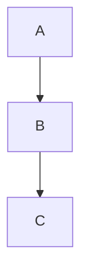
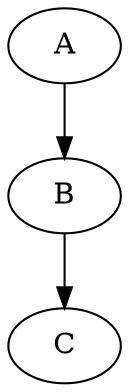

# Markdown Presenter

Author: Ali Khosro

A Simple Tool for Beautiful Presentations

<button class="open-file-btn">📂 Open Markdown File</button>

## Getting Started

### Loading Your Markdown

1. Click **Open Folder** (or press <kbd>o</kbd>) to choose a folder containing `.md` files
2. Select a file from the dropdown
3. Click **Refresh** (or press <kbd>r</kbd>) to reload after editing your file
4. Press <kbd>Esc</kbd> to collapse/expand the control panel

### URL Mode

Load a remote markdown file by appending `?md=URL` to the page URL:

```text
markdown-presenter.html?md=https://example.com/slides.md
```

### Print to PDF

For best results when printing to PDF:

- Paper size: **Letter**
- Orientation: **Landscape**
- Margins: **Default** or **Minimum**
- Enable: **Background graphics**

### Present Mode

- Press <kbd>p</kbd> or click **Present** to enter fullscreen slideshow
- Use arrow keys (<kbd>←</kbd> <kbd>→</kbd> <kbd>↑</kbd> <kbd>↓</kbd>) to navigate slides
- Press <kbd>Esc</kbd> to exit


## Customization Options

### Appearance Controls

| Control | Description |
|---------|-------------|
| Bg      | Background color |
| Text    | Main text color |
| Header  | Heading and accent color |
| Code Bg | Code block background |
| Code Text | Code block text color |
| Font    | Base font size (10-48px, default 22) |
| Width   | Max content width (30-100em) |

### Page Breaks

- Every `##` H2 heading starts a new page/slide automatically
- Enable **H3 break** checkbox to also break on `###` H3 headings
- Use `---` (horizontal rule) to force a page break anywhere

### Settings Persistence

Settings are saved automatically per document. Three levels:

| Button | Action |
|--------|--------|
| **Factory** | Reset to built-in defaults |
| **User** | Apply your saved profile |
| **Save** | Save current as your profile |


## Multi-Column Layouts

### Equal Width Columns

To present part of your markdown in a multi-column layout:
- wrap that part in a div with `column-count: 2`.
- It will create a multi column with equal widths.

<div style="column-count: 2; font-size: 0.8em;">

```text
<div style="column-count: 2; font-size: 0.8em;">
- Item one
- Item two
- Item three
- Item four
</div>
```

</div>

### Left-Right Columns

To have more control over column width and its content:

<div class="left-right">

<div>

- Use the `left-right` class
- wrap contents into two child divs

</div>

<div style="font-size: 0.8em;">

```html
<div class="left-right">
  <div>
    Left content (1/3 by default, flex: 1)
  </div>
  <div>
    Right content (2/3 by default, flex: 2)
  </div>
</div>
```

</div>

</div>


<div class="left-right">

<div>

- Default ratio is **1:2** (left:right).
- Customize column with flex `style="flex: 3"` in child div

</div>

<div style="font-size: 0.8em;">

```html
<div class="left-right">
  <div style="flex: 3">Left content</div>
  <div>Right content</div>
</div>
```

</div>

</div>

## Sharing & Export

### Share

Click **Share** to download a self-contained HTML file that includes:
- Your markdown content
- All relative images (embedded as base64)
- The full app (works offline, no server needed)

Recipients just open the file in any browser.

### Export

Click **Export** to download a clean copy of the app without any content. Give it to others so they can use it with their own markdown files.

**Note:** Share and Export work from the built (single-file) version of the app.


## Tips & Tricks

### Slide Structure

- Use `#` H1 for title slides (centered with padding)
- Use `##` H2 for section headers (auto page break)
- Use `###` H3 for sub-sections (optional page break)
- Use `---` for explicit page breaks within a section

### Diagrams

You can embed **Mermaid** and **Graphviz (DOT)** diagrams:





### Best Practices

1. Keep slides focused on one topic
2. Use code blocks for technical content
3. Use diagrams to explain flows
4. Test print preview before final PDF
5. Use **Save** to persist your preferred colors/font

### Keyboard Shortcuts

| Key | Action |
|-----|--------|
| `p` | Present |
| `r` | Refresh |
| `o` | Open folder |
| `Escape` | Toggle settings |
| `← → ↑ ↓` | Navigate slides |
